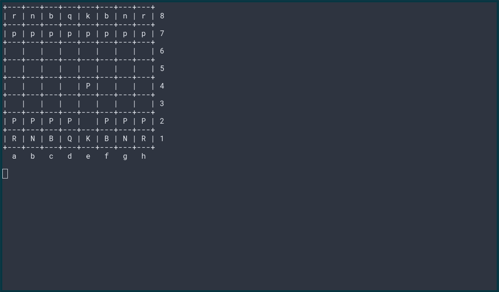

# skynet-dev

Stochastic parrot experiments.

## Install Python dependencies

```pip install openai chess stockfish```

## Install Stockfish

On Debian/APT-based Linux distributions:
apt install stockfish 

On macOS with Homebrew:
```brew install stockfish```

## Run Chess experiment

```
export OPENAI_KEY=<your-openai-API-key>
./checkmate.py
```


